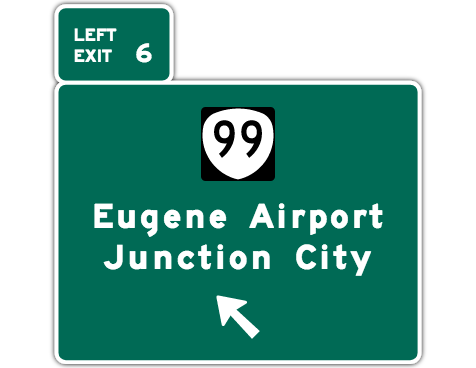

# Junction City

Junction City generates illustrations of freeway junctions in SVG format based on [OpenStreetMap](https://www.openstreetmap.org/)’s motorway junction tagging conventions. An idealized illustration of a freeway exit may be appropriate for a turn-by-turn navigation application to display to the user as they approach the exit. As a starting point, the illustrations attempt to adhere to the _[Manual on Uniform Traffic Control Devices](https://mutcd.fhwa.dot.gov/)_ (MUTCD) that is used throughout the United States. Route shields come from [Wikimedia Commons](https://commons.wikimedia.org/wiki/Category:Diagrams_of_road_signs_of_the_United_States). For consistency and familiarity, legends are set in [Roadgeek 2014](https://github.com/sammdot/roadgeek-fonts/).

Junction City is a work in progress. Currently, it generates only left- or right-side [Interchange Exit Direction Signs](https://mutcd.fhwa.dot.gov/htm/2003r1/part2/fig2e-20_longdesc.htm) with optional exit numbers, an optional shield, and one or more legends (control cities, other traffic generators, or road names).

  

## References

* [`destination`](https://wiki.openstreetmap.org/wiki/Key:destination)
* _[Standard Highway Signs](https://mutcd.fhwa.dot.gov/ser-shs_millennium_eng.htm)_
